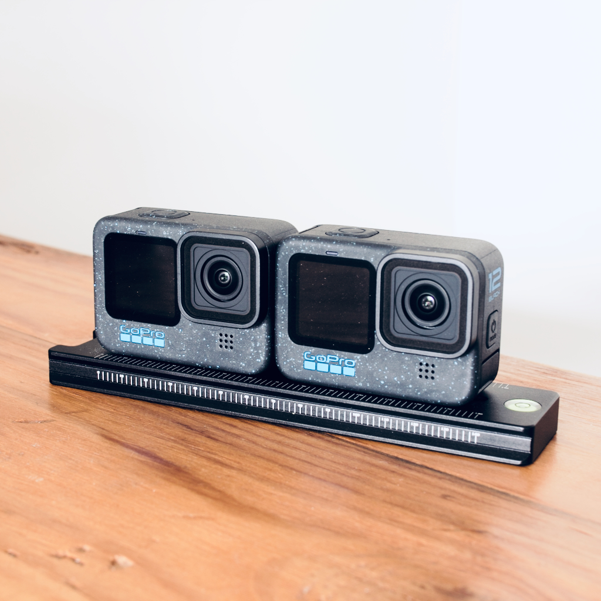

# One VR

## Augmented/Virtual Reality Camera Workflows

> "Is it possible to share our experiences and stories more truly than the familiar media formats we all know and love? Is there a medium which could be more immersive? Perhaps closer to a direct embodied re-experience?"

This repository contains notes on camera hardware and software workflows for generating [VR180](https://blog.youtube/news-and-events/the-world-as-you-see-it-with-vr180/) and 360 video.

## Example results

### Standard Display
Click/drag or turn mobile device to look around:  
[4K 30fps VR180 stereoscopic video](https://www.youtube.com/@felixtsao)  
[4K 60fps 360 monoscopic video](https://www.youtube.com/watch?v=hQ7O1qrUY-8)

### 3D Display (AR/VR Headset)
Download and playback in a VR180 supported device:  
[4K 30fps VR180 stereoscopic video](https://felixtsao.com/github/oneVR/sample_composite_3D_SBS_LR.mp4)

## Getting Started

The `vr180/` directory [readme](vr180/readme.md) outlines steps to build and run software to generate a VR180 video using sample input videos from an example camera rig.

### Active Directories

`vr180/`  
> VR180 software ([readme](vr180/readme.md))

`cam/`  
> Camera hardware and software configuration including camera intrinsics/extrinsics characterization for use in software tooling, 3D printable camera rig files (`.stl`), generator files (`.scad`) and camera control commands. Designs and calibration to support other cameras to be added here.

`img/`  
> Documentation and reference images

### Archived Directories (Deprecated)

`360warper/`  
> Image/video warper software to be used with video compositing tools like AFX, Blender, Nuke

`cpp/`  
> Image/video fusion stitching prototype

`viewer/`  
> Web browswer based VR 360 video/image player

## Workflow

#### Print/Build
3D printed fixtures and/or general slide rail mounting systems can be used to orient multiple cameras in a static calibrated orientation. See examples in the [multi-camera systems](#multi-camera-systems) section.
#### Capture
Record an event with the multi-camera system using any supported frame sync method (SMPTE timecode, gyro, genlock, NTP/PTP etc.)
#### Stitch/Process
Download and prepare video files from cameras and specify them as inputs to a video processing tool to create a VR180 or 360 video. This repository primarily supports software tooling in the `vr180/` directory. Additionally, [spatial-media](https://github.com/google/spatial-media) metadata that specifies VR format attributes is required to be encoded in the VR video file to enable proper display by most VR video players.
#### View
VR180 and 360 videos can be viewed on various devices. Youtube and other VR video sites support VR180 content for standard displays and 3D display on some [mobile](https://arvr.google.com/cardboard/) devices. AR/VR headsets have 3D video playback options varying by the manufacturer's software ecosystem (e.g. [Valve](https://store.steampowered.com/valveindex), [Meta](https://www.meta.com/quest/)).

## Multi-Camera Systems

<table>
<tr>
<td width="50%">

</td>
<td width="50%">
<h3> VR180 3D side-by-side (SBS) </h3>
A CNC machined aluminum slide rail can secure 2 GoPro Hero 12 cameras in a fronto-parallel, side-by-side orientation. Each camera inherits the viewpoint of each human eye when both cameras are placed a typical inter-pupillary distance apart and creates a 3D disparity/parallax/depth effect when viewed in an AR/VR headset. The <a href="https://github.com/felixtsao/oneVR/blob/main/vr180/readme.md">vr180</a> directory contains software which processes multiple camera streams into a single VR180 video file format for playback in VR/AR display. GoPro supports timecode frame <a href="https://community.gopro.com/s/article/HERO12-Black-Timecode-Sync?language=en_US" target="_blank">sync</a> to align both camera streams in time.
</td>
</tr>
</table>

### 360 Camera (Deprecated)

<table>
<tr>
<td width="50%">

</td>
<td width="50%">

</td>
</tr>
</table>

**This section and below has been deprecated.**

3D printed fixtures can be used to orient 6 SJ4000 cameras in a radially symmetric configuration. Overlapping field of views from all cameras creates areas for stitching/fusion software to blend into a seamless panoramic 360 video. When viewed in a AR/VR headset, a viewer can see video content in all directions. This configuration is limited to monoscopic video which does not support a similar depth effect as the VR180 configuration.

Version 2 left, pictured without upper mount. Version 3 on right with optional top camera expansion module.

### Bill of Materials - Hardware & Software

Listed below are items I have tested but any of them can be swapped out with other items that serve a similar purpose. Search [3DHubs](https://www.3dhubs.com) to find access to a nearby 3D printer. Some libraries have printers as well. Or build your own [RepRap](http://www.reprap.org) as a support project.

### Hardware

**a.** 6 or more SJ4000 action cameras (~$60 each), Alternatives include GoPro, Xiaomi (may need to modify 3D models). Can use less cameras by replacing stock lenses with wide angle lenses for Xiaomi and SJ4000.

**b.** A lower bracket/apparatus to seat cameras. Modify existing CAD designs in `cam/` directory to meet camera choice.

**c.** A matching upper apparatus to secure cameras. Likewise, modify existing CAD designs in `cam/` directory to meet camera choice.

**d.** (Optional) Zenith module for housing a single additional zenith camera i.e. "Sky Camera."

**e.** Standard Tripod

**f.** Standard computer, relatively powerful GPU for image processing preferred

**g.** Any mobile device with a modern web browser

**h.** A headmounted display to house mobile device for VR viewing like [Cardboard](https://www.google.com/get/cardboard/) or print one from [Thingiverse](http://www.thingiverse.com/search?q=vr+headset).

**h1** - 1x 1/4"-20 bolt for securing top mount to bottom mount. For SJ4000s, length of bolt must be > 3". May be different for other camera selections. Ideally, choose a length that allows bolt to stick past bottom mount an inch or two to connect to tripod with coupling bolt 'h7.'

**h2** - 2x Washers for 1/4"-20 bolt.

**h3** - 1x 1/4"-20 nut for tightening under bottom mount.

_h4 - h6 only applies if using top camera module_

**h4** - 2x 6-32 screws (> 1.5" length) to mount top camera expansion module.

**h5** - 4x #6 washers.

**h6** - 2x 6-32 nuts.

**h7** - 1x 1/4"-20 coupling nut for joining entire setup to tripod head.

(Optional) Switch to gen-lock/sync record controls for cameras, necessary to mitigate rolling shutter when capturing scenes with fast motion, also provides convenience for starting/stopping recording, requires soldering

### Software

 * [OpenSCAD](http://www.openscad.org) for rapid, parameterized prototyping of 3D printable VR camera mounts (Free)
 * [After Effects CC](http://www.adobe.com/products/aftereffects.html) for basic stitching using warp plugins (Free trial, then monthly subscription)
 * (Optional) Stitching plugins for After Effects like [Skybox Mettle](http://www.mettle.com/product/skybox/), [PTGui](https://www.ptgui.com/), [Kolor](http://www.kolor.com/) or [VideoStitch](http://www.video-stitch.com/) for professional stitching results (> $90)
 * [Blender](https://www.blender.org/) for alternative stitching method to After Effects, also includes capabilites to composite text and 3D. (Free)
 * [YouTube 360 Injector](https://support.google.com/youtube/answer/6178631?hl=en) for tagging proper metadata to final 360 video for properly uploading to YouTube (Free)

### Stitching Techniques

[Video Tutorial: Hand-stitching in After Effects (Quick)](https://www.youtube.com/watch?v=5elOFvyL4KA)  
[Video Tutorial: Hand-stitching (Detailed using 360warper script)](https://www.youtube.com/watch?v=F78drmyd21I)  
_or_  
For fully automated process, compile and run stitcher in `/cpp` (WIP)

Stitcher uses ORB feature descriptor pairs to register overlapping images. ORB is also free from patent restrictions.

### Viewing

Web VR 360 Player - [Demo Link](https://cdn.rawgit.com/felixtsao/oneVR_devel/master/viewer/index.html)

Visit `viewer/` directory for usage and source code.

### 3D Printing

Print camera mount yourself or find a local printer through [3DHubs](https://www.3dhubs.com) or the local library.

Older version of `mono_lower_6x_sj4000.stl` printed on a Makerbot Replicator 2 with Red PLA. The mount takes about 4 hours to print if things go smoothly! Newer version of mount printed on an open-source Prusa i3 design, right, with a layer height of 0.27mm through a 0.4mm extruder nozzle.

<table>
<tr>
<td width="50%">

</td>
<td width="50%">

</td>
</tr>
</table>

#### Creating a new camera mount

Files are located in `cam/` directory, organized by camera model. To create a new camera mount, open the closest existing `.scad` file and adapt it by changing the camera trench dimensions. Camera dimensions are listed as variables at the top of the `.scad` files and should globally change the trench sizes across the mount. To add more cameras, simply increase the distance of the optical center and make additional copies of the trenches and assign each trench with the appropriate angle. The numbers are technically unitless but they default to millimeter for most printers. Be sure to add 1 to the value used for the camera dimension for a little breathing room.

### Technical References

1) [Course: Computational Photography CS534, UW-Madison, Dyer](http://pages.cs.wisc.edu/~dyer/cs534/)
2) [Text: Chapter 9, Computer Vision, Szeliski](http://szeliski.org/Book/)
3) [Paper: ORB Feature Descriptor, Rublee](http://www.vision.cs.chubu.ac.jp/CV-R/pdf/Rublee_iccv2011.pdf)
4) [Docs: OpenCV](http://docs.opencv.org/3.1.0/)
5) [Docs: ThreeJS](https://threejs.org/)
6) [Docs: RepRap](http://www.reprap.org/)
