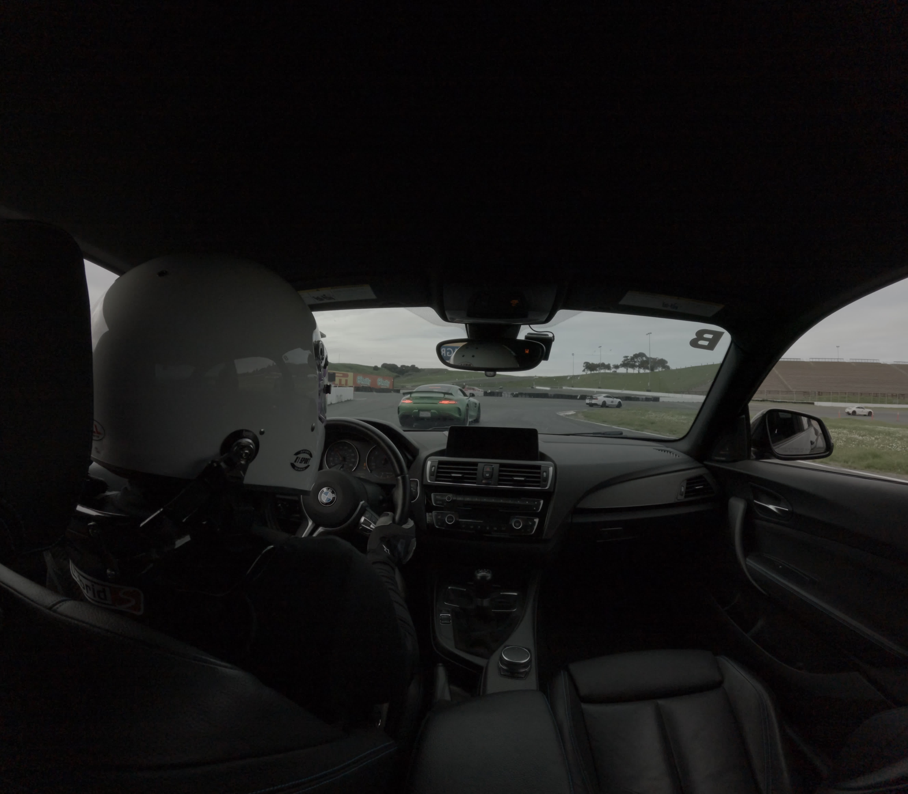
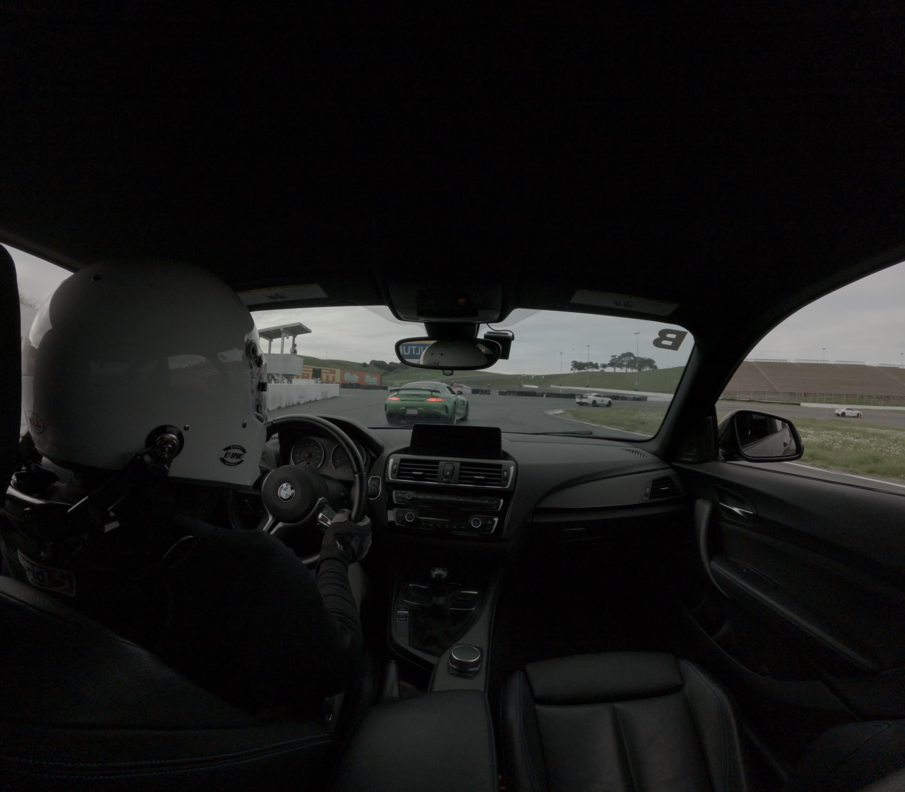
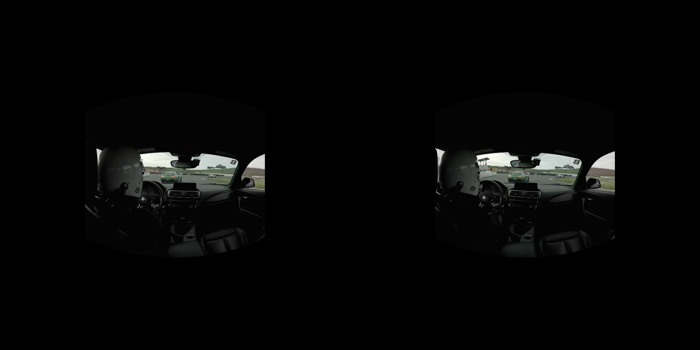

# VR180

For general information about VR180 video format, see this blog post [here](https://blog.youtube/news-and-events/the-world-as-you-see-it-with-vr180/).

## Hardware

<table>
<tr>
<td width="50%">

</td>
<td width="50%">
<h3> VR180 3D side-by-side (SBS) </h3>
2 cameras can be oriented in the same general viewing direction, separated by a typical inter-pupillary distance, to emulate the distinct perspectives each eye (left and right) sees when viewing a scene. The slight parallax formed between the varying perspectives creates a sense of depth when the left camera is shown to the left eye, and likewise with the right eye in a device like a VR headset. There are some commercial and prosumer cameras designed with dual lens/sensors but any fixture with 2 cameras works as well, like 2 GoPros placed side by side.
</td>
</tr>
</table>

## Software

The `warp_encoder/` directory contains code which transforms video captured from 2 wide-angle cameras into a standard VR180 video format for playback in a VR/AR headset and/or other interactive display which supports variable viewing angles.

Input videos representing the left camera/eye and right camera/eye can be concatenated side-by-side and projected/warped into an equirectangular/spherical encoding and stored in a single standard 2D video format i.e. mp4 h.264/265 by command line interface.

## Getting Started

As validation of building and running `warp_encoder`, `sample_composite_3D_SBS_LR.mp4` can be regenerated from `sample_left.mp4` and `sample_right.mp4` camera streams. The composite should look like a side-by-side concatenation of the left and right inputs with some warping and frame padding applied based on field of view specified in the camera `calibration.yaml`.

Sample files:  
[sample_left.mp4](https://felixtsao.com/github/oneVR/sample_left.mp4)  
[sample_right.mp4](https://felixtsao.com/github/oneVR/sample_right.mp4)  
[sample_composite_3D_SBS_LR.mp4](https://felixtsao.com/github/oneVR/sample_composite_3D_SBS_LR.mp4)

<table>
<tr>
<td width="25%">

sample_left.mp4
</td>
<td width="25%">

sample_right.mp4
</td>
<td width="50%">

sample_composite_3D_SBS_LR.jpg
</td>
</tr>
</table>

### Setup
To build and run `warp_encoder` software, a Linux distribution with a CUDA supported Nvidia GPU is required. A containerized cloud instance like [Runpod](https://console.runpod.io/deploy) also works.

Clone this repository and install/verify dependencies with the `scripts/setup_linux.sh`. 
```
./setup_linux.sh
```
Once setup has been completed, build the warp software with:
```
bazel build //vr180/warp_encoder:warp_encoder
```
Configure target input/output file locations and other settings in the `warp_encoder/config.yaml` [config](warp_encoder/config.yaml) file
```yaml
    files: {
        camera_config: /workspace/oneVR/cam/gopro_hero_12/calibration.yaml,
        input_left: /workspace/data/sample_left.mp4,
        input_right: /workspace/data/sample_right.mp4,
        output_directory: /workspace/data/,
        output_composite: composite_3D_SBS_LR.mp4
    },
    output_settings: {
        width: 8192,
        height: 4096,
        start_time_seconds: 0,
        duration_seconds: 5,
        contrast: 1.2,
        brightness: 32,
        # fps: 30          # default 29.97 fps if not specified
    },
    # ...
```
Note the `camera_config` file which can be found the top-level `/cam` directory. This contains camera extrinsics/intrinsics parameter data to accompany the input left and right videos. Use an existing defined camera `config.yaml` or create a new one to use.

[Example](../cam/gopro_hero_12/calibration.yaml) for GoPro Hero 12. After configuration, run and specify the full path to the config file:
```
bazel run //vr180/warp_encoder:warp_encoder vr180/warp_encoder/config.yaml
```
On a RTX-3090, rendering a 5 second clip with the config above took about 1 minute. When using the sample input videos, it is expected that there is a 61 frame offset between the left and right camera streams.
```
left_timecode: 15:33:13;09
right_timecode: 15:33:11;08
frame_sync discarded 61 frames from right camera

real    0m56.889s
user    0m55.804s
sys     0m1.011s
```
After warp encoding has finished, the following file will be generated which can be viewed in a VR headset video player.
```
composite_3D_SBS_LR.mp4
```
When using the sample videos input videos, it is expected that the newly generated `composite_3D_SBS_LR.mp4` video should look identical/similar to `sample_composite_3D_SBS_LR.mp4`.
